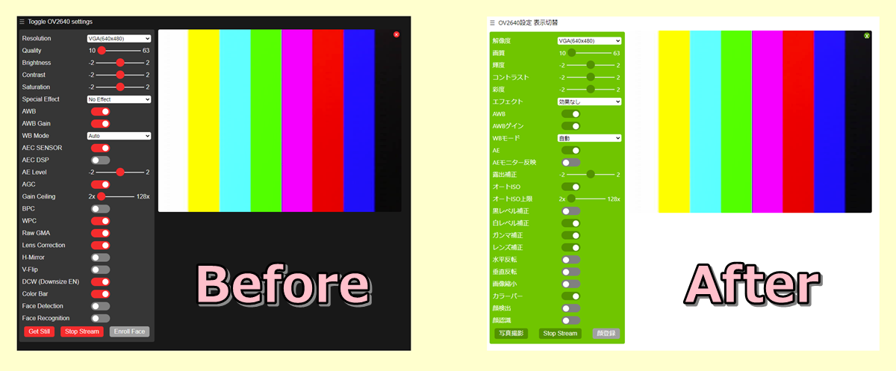
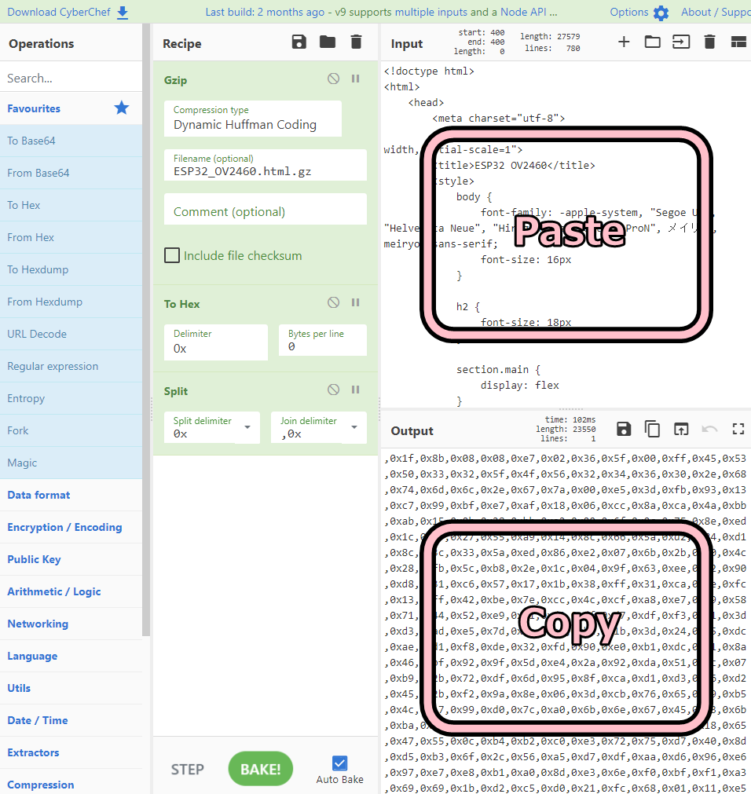
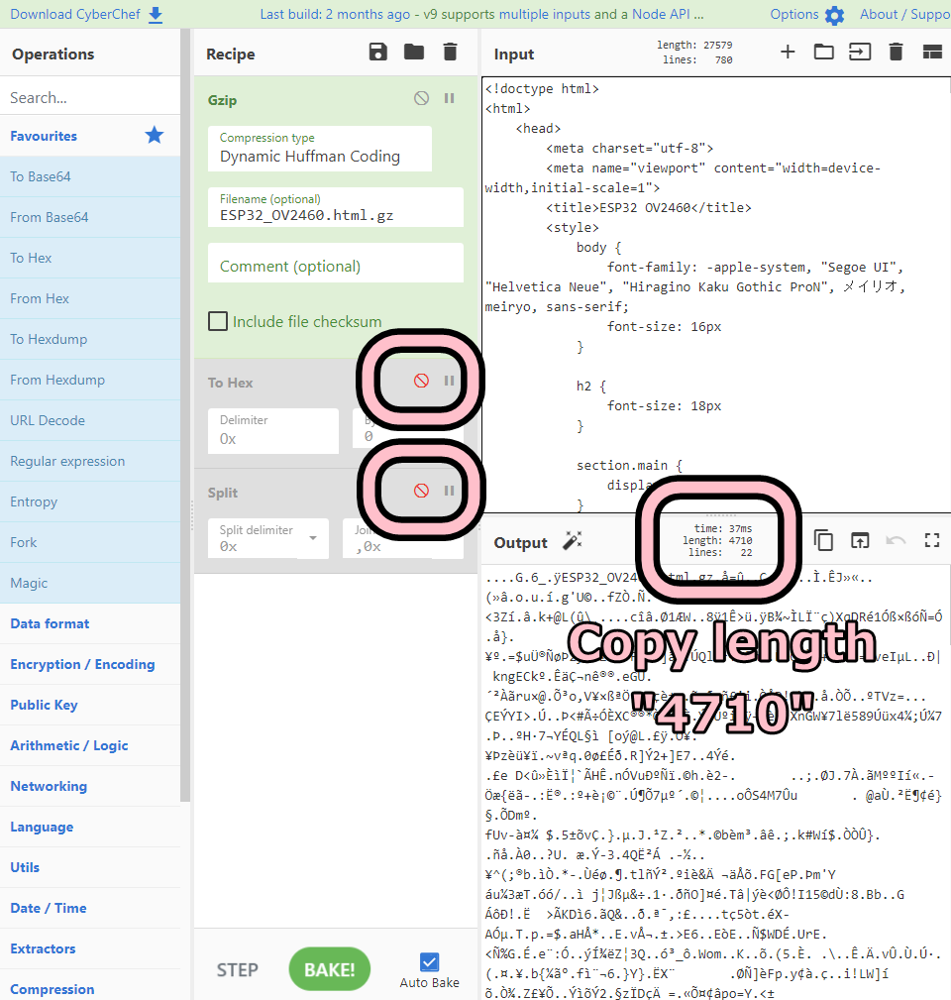
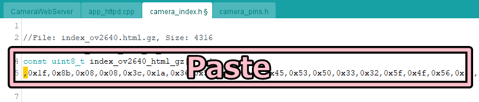
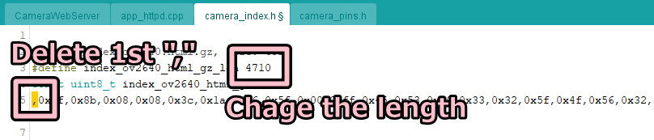

# How to change HTML in sketch example "ESP32>Camera>CameraWebServer"

Here is the completed image!!!




## Preparing to use the CameraWebServer library. (ex. M5Camera)

1. Download the latest sketch example.

https://github.com/espressif/arduino-esp32/tree/master/libraries/ESP32/examples/Camera/CameraWebServer

2. If your M5Camera version is B then edit the code as below.

Before
```
//#define CAMERA_MODEL_M5STACK_V2_PSRAM // M5Camera version B Has PSRAM
```
After
```
#define CAMERA_MODEL_M5STACK_V2_PSRAM // M5Camera version B Has PSRAM
```

## Change HTML. (ex. ESP32_OV2460.html)

1. Converts a file from HTML format to GZIP format.

1-1. Visit the website.
https://gchq.github.io/CyberChef/#recipe=Gzip('Dynamic%20Huffman%20Coding','ESP32_OV2460.html.gz','',false)To_Hex('0x',0)Split('0x',',0x')

1-2. Change the filename as you like.

1-3. Paste the HTML code in the input field.

1-4. Copy the GZIP format value in the output field.



2. Get the GZIP length.

2-1. Disable "To Hex" and "Split".

2-2. Copy the GZIP length from "length: xxxx".



3. Embed the GZIP data in code.

3-1. Replace with the GZIP data in array (index_ov2640_html_gz[]) of file (camera_index.h).



3-2. Remove leading comma, change length.



4. Build with Arduino IDE.

